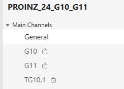
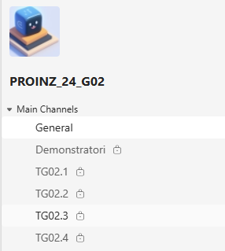

# 🚀 EduTeamsBuilder

This repository contains PowerShell scripts designed to automate the creation and management of Microsoft Teams for student projects. It supports team creation, channel setup, user assignment, and data export. The project is especially targeted for managing a **large number of groups and teams** efficiently.

---

## 📘 Project Description

The goal of this project is to streamline the setup of Microsoft Teams for academic group work. It automates repetitive tasks such as creating teams, assigning students, and configuring private channels. This improves efficiency and reduces manual errors.

---

## ✅ Key Features

- Create private Teams with custom prefixes and descriptions
- Generate group-specific private channels
- Assign students to Teams and channels with roles
- Validate input data and handle errors gracefully
- Export created Teams data to CSV
- Scale to support a large number of groups and teams

---

## 🛠️ Technologies Used

- PowerShell
- Microsoft Teams PowerShell Module
- CSV for data input/output

## 🔧 Prerequisites to run scrpits

Before running the script, ensure the following:

1. **PowerShell Execution Policy**
   ```powershell
   Set-ExecutionPolicy RemoteSigned -Scope CurrentUser
   ```

2. **Microsoft Teams PowerShell Module**
   Install and import the module:
   ```powershell
   Install-Module -Name MicrosoftTeams -Scope CurrentUser
   Import-Module MicrosoftTeams
   ```

3. **Sign in to Microsoft Teams**
   The script will prompt you to sign in:
   ```powershell
   Connect-MicrosoftTeams
   ```

4. **Permissions**
   You must have following role:
   - Teams Administrator
   -

## 🚀 Usage

### Create Teams and Channels
```powershell
./CreateTeams.ps1 -Prefix "PROINZ_25_" -Description "Project Teams for 2025"
```

### Add Users to Teams
```powershell
./AddUsersToTeams.ps1 -StudentList "data/Example_StudentToTeams_DefaultMember.csv" -Prefix "PROINZ_25_"
```

### Add Users to Group Channels with Roles
```powershell
./AddUsersToGroupChannels.ps1 -StudentList "data/Example_StudentToTeams.csv" -Prefix "PROINZ_25_"
```

---

### ⚠️ Disclaimer on Roles
When assigning users to Teams and channels, be careful with role assignments.  
- **Students** should normally be added as *Members*.  
- **Teaching Assistants (TAs) and Demonstrators** are usually added separately and may require *Owner* or other special permissions depending on the course setup.  
It is strongly recommended to double-check the CSV input files and role configurations before running the scripts to avoid misassignments.

---

## 📸 Example Screenshots

Below are sample structures of created Teams and channels:

**Multiple Groups in One Team:**  


**Team with Demonstrators and Subgroups:**  

